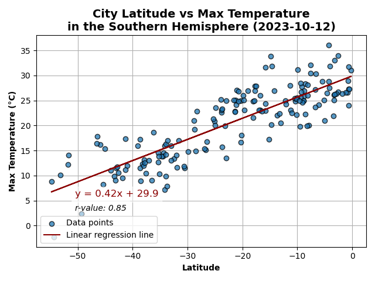

# Python API Challenge: WeatherPy

**Student name:** Tania Barrera

---

- [Background](#background)
- [Summary](#summary)
  - [Part 1: WeatherPy](#part-1-weatherpy)
    - [Requirement 1: Create Plots to Showcase the Relationship Between Weather Variables and Latitude](#requirement-1-create-plots-to-showcase-the-relationship-between-weather-variables-and-latitude)
    - [Requirement 2: Compute Linear Regression for Each Relationship](#requirement-2-compute-linear-regression-for-each-relationship)
  - [Part 2: VacationPy](#part-2-vacationpy)
- [References](#references)

---

This repo contains my work for the sixth weekly challenge of the UofT SCS edX Data Bootcamp.

---

## Background

Data's true power is its ability to definitively answer questions. So, let's take what you've learned about Python requests, APIs, and JSON traversals to answer a fundamental question: "What is the weather like as we approach the equator?"

Now, we know what you may be thinking: “That’s obvious. It gets hotter.” But, if pressed for more information, how would you prove that?

## Summary

This activity is broken down into two deliverables, WeatherPy and VacationPy.

1. **WeatherPy Notebook:** [WeatherPy/WeatherPy.ipynb](WeatherPy/WeatherPy.ipynb)

2. **VacationPy Notebook:** [WeatherPy/VacationPy.ipynb](WeatherPy/VacationPy.ipynb)

### Part 1: WeatherPy

**Notebook:** [WeatherPy/WeatherPy.ipynb](WeatherPy/WeatherPy.ipynb)

#### Requirement 1: Create Plots to Showcase the Relationship Between Weather Variables and Latitude

Steps:

1. Use the OpenWeatherMap API to retrieve weather data from the cities list generated in the starter code. 

    Result:
    

2. Create a series of scatter plots to showcase the relationship between Latitude and Temperature, Latitude and Humidity, Latitude and Cloudiness and Latitude and Wind Speed.
  
    Results:
     1. Latitude vs. Temperature
    

     2. Latitude vs. Humidity
    

     3. Latitude vs. Cloudiness
    

     4. Latitude vs. Wind Speed
    

#### Requirement 2: Compute Linear Regression for Each Relationship

Steps:

1. Compute the linear regression for each relationship. Separate the plots into Northern Hemisphere (greater than or equal to 0 degrees latitude) and Southern Hemisphere (less than 0 degrees latitude). Next, create a series of scatter plots. Be sure to include the linear regression line, the model's formula, and the r values.

    Results:

    1. Northern Hemisphere: Temperature vs. Latitude
    

    2. Southern Hemisphere: Temperature vs. Latitude
    
    
    3. Northern Hemisphere: Humidity vs. Latitude
    
    
    4. Southern Hemisphere: Humidity vs. Latitude
    
    
    5. Northern Hemisphere: Cloudiness vs. Latitude
    
    
    6. Southern Hemisphere: Cloudiness vs. Latitude
    
    
    7. Northern Hemisphere: Wind Speed vs. Latitude
    
    
    8. Southern Hemisphere: Wind Speed vs. Latitude
    

    Discussions:
    1. **Temperature:**  
    The correlation between city latitude and maximum temperature is strong for cities in both the northern and the southern hemispheres (r values are -0.87 and 0.85, respectively). It is negative for the northern hemisphere and positive for the southern hemisphere, meaning that as distance from the equator increases, maximum temperature decreases. We can conclude that distance from the equator (i.e. the absolute value of latitude) has a strong relationship with maximum temperature. The r2 values indicate that the linear regression lines explain most of the variation observed (over 70%).

    2. **Humidity:**  
    The correlation between city latitude and humidity is very weak for cities in both the northern and the southern hemispheres (r values are 0.13 and 0.04, respectively). Both are positive, meaning that as latitude increases, humidity increases as well, but they are so close to 0 that this is negligible and the relationship is probably due to randomness. We can conclude that latitude has a very weak relationship with humidity. The r2 values indicate that the linear regression lines explain a very small percentage of the variation observed (less than 2%).

    3. **Cloudiness:**  
    The correlation between city latitude and cloudiness is very weak for cities in both the northern and the southern hemispheres (r values are 0.25 and 0.13, respectively). Both are positive, meaning that as latitude increases, cloudiness increases as well. We can conclude that latitude has a very weak relationship with cloudiness that is very possibly due to randomness. The r2 values indicate that the linear regression lines explain a very small percentage of the variation observed (less than 7%).

    4. **Wind Speed:**  
    The correlation between city latitude and wind speed is very weak for cities in the northern hemisphere and weak for cities in the southern hemispheres (r values are 0.29 and -0.36, respectively). It is positive for the northern hemisphere and negative for the southern hemisphere, meaning that as distance from the equator increases, wind speed increases as well. We can conclude that distance from the equator (i.e. the absolute value of latitude) has a weak relationship with wind speed that might be due to randomness. The r2 values indicate that the linear regression lines explain a very small percentage of the variation observed (less than 15%).
    

### Part 2: VacationPy

**Notebook:** [WeatherPy/VacationPy.ipynb](WeatherPy/VacationPy.ipynb)

Steps:

1. Create a map that displays a point for every city in the `city_data_df` DataFrame. The size of the point should be the humidity in each city.

    Result:
    

2. Narrow down the `city_data_df` DataFrame to find your ideal weather condition.

    Result:
    

3. Create a new DataFrame called `hotel_df` to store the city, country, coordinates, and humidity and use the Geoapify API to find the first hotel located within 10,000 meters of your coordinates for each city.

    Result:
    

4. Add the hotel name and the country as additional information in the hover message for each city on the map.

   Result:
    

---

## References

Challenge instructions and starter files, as well as some code sections that were adapted from the UofT SCS EdX Data Bootcamp class activities:

© 2022 edX Boot Camps LLC. Confidential and Proprietary. All Rights Reserved.

Some other code sections were adapted from other sources, specific explanations are found within the code comments:

| Purpose 	| URL 	|
|------------------------------------	|------------------------------------------	|
| How to get today's date for plot titles 	| https://stackoverflow.com/a/60234593 	|
